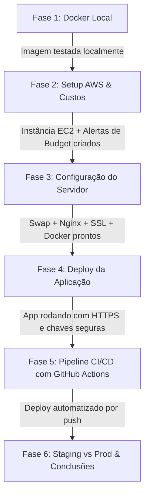

# 🎯 Objetivos e Diretrizes — Projeto de Estudo de Deploy na AWS (Atlas Web)

Este documento define o propósito, os objetivos de aprendizado, as diretrizes de mentoria para os agentes de IA e o roteiro técnico para a migração e deploy do projeto **Atlas Web** na infraestrutura da **AWS**.

---

## 1. Natureza e Propósito do Projeto

* **Classificação:** Projeto de **estudo prático, laboratório e aprofundamento técnico**.
* **Contexto de Origem:** A aplicação já foi deployada anteriormente em um servidor Ubuntu corporativo interno (com processo manual, Nginx, `tmux` e ambiente virtual).
* **Novo Desafio:** Criar um ambiente independente na AWS para dominar o ciclo moderno de desenvolvimento e operações (DevOps/Cloud), entendendo a fundo:
  * Conteinerização profissional com **Docker**;
  * Provisionamento e redes na **AWS (EC2, Security Groups, Elastic IP)**;
  * **Controle rigoroso de custos e limites do Free Tier**;
  * **Performance e gestão de memória** (mitigação de estouro de RAM/OOM com swap);
  * **Segurança de credenciais e chaves de API** (OpenAI, Gemini);
  * Automação de deploy via **CI/CD (GitHub Actions)**;
  * Arquitetura de múltiplos ambientes (**Produção vs. Staging/Teste** de baixo custo).

---

## 2. 🤖 Diretrizes Obrigatórias para os Agentes de IA (Mentoria Ativa)

Todo e qualquer agente de IA que trabalhar neste repositório **DEVE** seguir estritamente as diretrizes abaixo:

1. **Papel de Mentor, não de executor cego:**
   * Não apenas cuspa código ou execute scripts no piloto automático.
   * Explique o **"porquê"** de cada comando, decisão técnica ou configuração adotada.
2. **Alerta Proativo de Riscos e Esquecimentos:**
   * **Se o usuário estiver prestes a esquecer algo crítico, alerte imediatamente.** Exemplos:
     * Deixar portas sensíveis abertas para a internet no Security Group;
     * Commitar ou embutir chaves de API dentro da imagem Docker ou no Git;
     * Recursos da AWS que geram cobrança contínua (ex: Load Balancers, Elastic IPs não associados, NAT Gateways);
     * Falta de swap em máquinas com 1 GB de RAM para uma aplicação pesada em dados geoespaciais;
     * Perda de conexão WebSocket do Streamlit no Nginx.
3. **Didática Voltada a PMEs:**
   * Priorize arquiteturas realistas para empresas de pequeno e médio porte: simples, econômicas, fáceis de manter e sem custos ocultos desnecessários.
4. **Alinhamento com as Regras de Negócio do Projeto:**
   * Respeitar a versão travada do Streamlit (`streamlit==1.36.0`);
   * Respeitar a estratégia de cache em memória: `@st.cache_resource` para dados geoespaciais pesados (`empreendimento_geo.parquet`, ~114 MB em disco / ~255 MB em RAM) e `@st.cache_data` para tabelas leves.

---

## 3. Objetivos de Aprendizado e Metas Técnicas

### 3.1. Conteinerização com Docker
* [ ] Criar um `Dockerfile` otimizado e seguro com Python 3.11 e as dependências de sistema (C/C++) necessárias para `geopandas`, `shapely` e `pyarrow`.
* [ ] Criar um `.dockerignore` enxuto para evitar que caches, ambientes virtuais (`.venv`) e dados brutos desnecessários entrem na imagem.
* [ ] Substituir ferramentas legadas de terminal (como `tmux`) pelas políticas nativas de ciclo de vida do Docker (`--restart unless-stopped`).
* [ ] Testar e validar a execução do container localmente antes de qualquer deploy em nuvem.

### 3.2. Infraestrutura na AWS & Controle de Custos
* [ ] **AWS Budgets:** Configurar na largada um alarme de faturamento com teto rígido (ex: \$1 a \$5 USD) para evitar qualquer cobrança acidental.
* [ ] **EC2 Free Tier:** Provisionar uma instância Linux (Ubuntu) elegível ao Free Tier (`t2.micro` ou `t3.micro`).
* [ ] **Mitigação de Memória (Swap Virtual):** Configurar 2 GB a 4 GB de memória Swap em disco SSD para absorver os picos de carga da base geoespacial sem acionar o *OOM Killer*.
* [ ] **Gestão de Custos:** Entender o impacto financeiro de instâncias sob demanda vs. instâncias pausadas vs. custos de tráfego de dados e discos EBS.

### 3.3. Redes e Segurança
* [ ] **AWS Security Groups:** Trancar todo o tráfego externo por padrão e liberar estritamente:
  * Porta `22` (SSH restrito preferencialmente ao IP de desenvolvimento);
  * Porta `80` (HTTP) e `443` (HTTPS).
  * A porta interna do Streamlit (`8501`) **nunca** deve ser aberta ao mundo.
* [ ] **Segregação de Segredos:**
  * O arquivo `.env` nunca entra no Docker nem no GitHub.
  * No servidor, o `.env` é injetado via parâmetro de execução do container (`--env-file`) ou armazenado com permissões restritas de arquivo (`chmod 600`).
* [ ] **Cloudflare / Proteção de Borda (Conceitual/Prático):**
  * Entender os benefícios de usar o Cloudflare na frente da AWS (ocultar IP real, mitigação de ataques DDoS, cache de assets estáticos e facilidade com SSL).

### 3.4. Exposição Web, Nginx e SSL
* [ ] Configurar o **Nginx** na EC2 como *Reverse Proxy* direcionando o tráfego das portas 80/443 para a porta interna 8501 do Docker.
* [ ] Garantir o suporte completo aos cabeçalhos de **WebSocket** (`Upgrade` e `Connection "upgrade"`), essenciais para o funcionamento reativo do Streamlit.
* [ ] Configurar domínio e certificado SSL gratuito:
  * Avaliar DNS dinâmico gratuito (DuckDNS / sslip.io) ou domínio próprio;
  * Instalar e automatizar renovação de HTTPS via **Certbot (Let's Encrypt)**.

### 3.5. Automação CI/CD (GitHub Actions)
* [ ] Criar um *workflow* no GitHub Actions que seja disparado a cada `push` na branch principal.
* [ ] O pipeline deve:
  1. Conectar com segurança na EC2 via chave SSH (armazenada em *GitHub Secrets*);
  2. Atualizar o repositório (`git pull`);
  3. Reconstruir/atualizar o container Docker;
  4. Reiniciar o serviço com zero intervenção manual.
* [ ] **Estratégia de Ambientes (Prod vs. Staging):**
  * Entender e modelar como rodar um ambiente de testes na mesma máquina EC2 (ex: porta interna secundária `8502` para a branch `develop`) para economizar recursos sem pagar por dois servidores.

---

## 4. Roteiro Sugerido de Execução

1. **Fase 1 — Docker Local:** Criar `Dockerfile`, `.dockerignore` e rodar a aplicação no Docker local da sua máquina para validar funcionamento sem dependências do SO hospedeiro.
2. **Fase 2 — Setup na AWS:** Criar conta/acessar console, criar alarme de faturamento no AWS Budgets, configurar Security Group e subir a EC2 Free Tier.
3. **Fase 3 — Preparação da EC2:** Conectar via SSH, configurar Swap de memória (2GB-4GB), instalar Docker e Nginx.
4. **Fase 4 — Deploy Inicial & SSL:** Apontar domínio/DNS dinâmico, gerar certificado Let's Encrypt com Certbot, subir o container com o `.env` injetado com segurança.
5. **Fase 5 — Esteira CI/CD:** Configurar chaves no GitHub Secrets e criar o arquivo `.github/workflows/deploy.yml` para automação total.
6. **Fase 6 — Ambiente de Testes & Documentação:** Simular fluxo de homologação e registrar aprendizados na documentação.

---

## 5. Checklist de Aprendizado (Para o Usuário Validar seu Domínio)

Ao final do projeto, o usuário deverá ser capaz de responder com segurança:
- [ ] Por que o Streamlit precisa de configurações específicas de WebSocket no Nginx?
- [ ] Como o Swap evita que a EC2 trave com a biblioteca GeoPandas em instâncias de 1 GB de RAM?
- [ ] Como o Docker garante que o app funcione na nuvem exatamente como na máquina local?
- [ ] Onde as chaves de API da OpenAI/Gemini ficam guardadas e por que nunca entram na imagem Docker?
- [ ] O que é um Security Group e por que a porta 8501 não deve ser aberta publicamente?
- [ ] Como o GitHub Actions faz deploy sem expor senhas do servidor?
